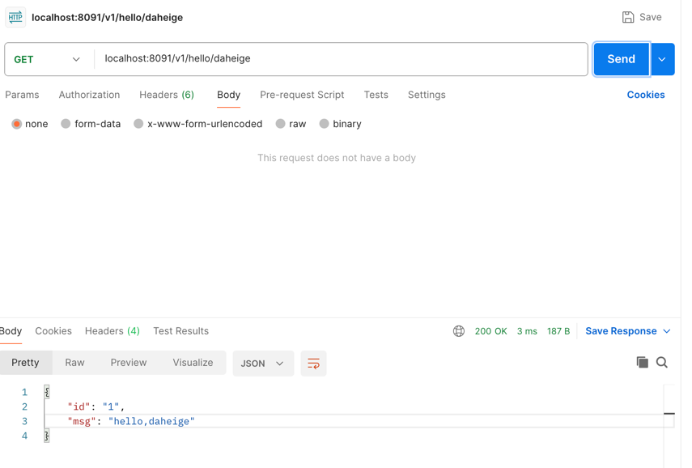

# gateway实现
整个gateway实现基于grpc gateway组件实现，具体实现方式如下：
1. 需要更改下proto文件中的rpc方法，新增如下内容
```protobuf
service Greeter {
  rpc Hello (HelloRequest) returns (HelloReply) {
    option (google.api.http) = {
      get: "/v1/hello/{msg}"
    };
  }
}
```
2. 生成gateway代码
```shell
sh gen-gateway.sh
```
3. 运行gateway
go run gateway/main.go

运行效果如下：
