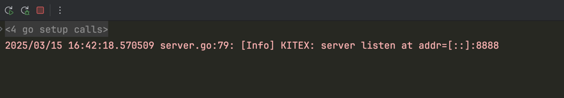
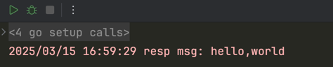

# kitex实战
具体实现步骤如下：
1. 环境准备参考[kitex-in-action/readme.md](../readme.md)
2. 新建kitex-example目录和kitex-example/bin目录
3. 在kitex-example/bin目录中，添加如下文件
- [gen-layout.sh](bin/gen-layout.sh)
- [gen-pb.sh](bin/gen-pb.sh)
- [greeter_impl.tpl](bin/greeter_impl.tpl)
- [main_code.tpl](bin/main_code.tpl)
4. 新建kitex-example/idl目录，并在该目录中添加如下proto文件
```protobuf
syntax = "proto3";

package helloworld;

// 这里的pb前面的路径可以忽略，或者可以将生成的代码放在制定的git仓库中
// 这个路径是一个相对路径，直接写pb/就可以
option go_package="pb/";

service Greeter {
  rpc Hello (HelloRequest) returns (HelloReply) {}
}

message HelloRequest {
  string msg = 1;
}

message HelloReply {
  int64 id = 1;
  string msg = 2;
}
```
5. 在kitex-example目录中新建`Makefile`文件，并添加如下代码：
```makefile
# go.mod文件中的模块名字
module_name := kitex-example
# 服务名字对应proto文件的服务名的小写名字
service_name := greeter
# proto文件名字
proto_name := helloworld.proto

# 仅仅是生成脚手架代码
gen-layout:
	kitex -service ${service_name} -module ${module_name} -I idl idl/${proto_name}
	sh bin/gen-layout.sh ${module_name}

# 当proto文件发生更改，执行该命令，并实现对应的service方法即可
gen-pb:
	kitex -module ${module_name} -I idl idl/${proto_name}
	sh bin/gen-pb.sh ${module_name}
```
6. 执行`make gen-layout`命令，将生成greeter微服务的layout目录结构
- 这一步可以根据实际情况调整，如果仅仅是生成pb文件，只需要执行`make gen-pb`命令即可，这种情况需要自行实现greeter微服务接口。
- 当proto协议发生变化时，可以直接执行`make gen-pb`生成pb文件，并自行实现grpc相关微服务方法即可。
7. 切换到kitex-example/cmd目录中执行如下命令启动服务
```shell
cd cmd/rpc
go run main.go
```
启动效果如下：<br/>：

# 客户端代码验证
```shell
go run client/client.go
```
运行效果如下图所示<br/>：


# validator使用
通过`tools/validator_gen`插件实现
# 更多kitex用法
参考[hello](../hello)
